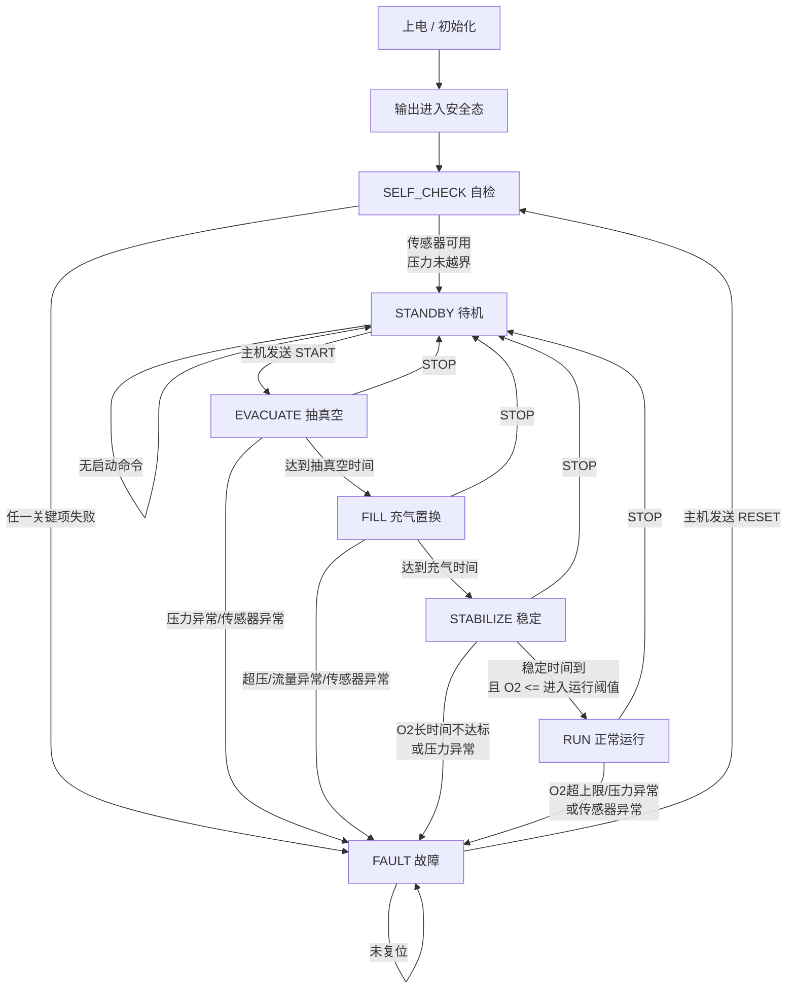
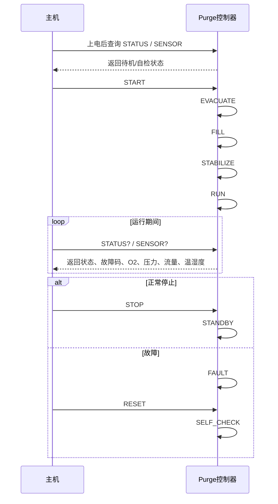

# Purge 控制逻辑流程图

## 1. 文档目的

本文档用于把当前 `Purge_Control` 的业务逻辑整理成一份更直观的流程图说明，重点回答下面几个问题：

- 上电后系统先做什么
- 哪些条件满足后才能启动 Purge 流程
- 每个阶段哪些电磁阀打开，哪些关闭
- 什么时候设定 `SFC` 流量
- 什么时候才能认为已经稳定，可以进入正常进气运行
- 出现什么异常时要立即退出到故障态

本文档基于当前工程中的简化控制框架和你已经确认过的工艺条件：

- 工艺要求为“边进边排”
- 当前只使用 `Inlet1`
- `o_vacuum_pin` 控制真空发生器
- `o_relay_pin` 控制真空电磁阀
- `o_py_relay_pin` 当前未使用
- `SFC` 与 `O2` 共用同一串口总线，采样时需要顺序轮询

---

## 2. 控制对象对应关系

| 控制对象 | 当前硬件输出 | 说明 |
| --- | --- | --- |
| 真空发生器 | `o_vacuum_pin` | 打开后提供真空源 |
| 真空电磁阀 | `o_relay_pin` | 接通或切断真空支路 |
| 进气阀1 | `o_air_inlet_pin` | 当前主进气阀 |
| 进气阀2 | `o_air_inlet2_pin` | 当前工艺不用，保持关闭 |
| 出气阀 | `o_air_outlet_pin` | “边进边排”工艺下在 `FILL/STABILIZE/RUN` 保持打开 |
| 预留继电器 | `o_py_relay_pin` | 当前不参与控制 |
| 流量控制器 | `SFC` | 通过 `SFC_SetFlowValue()` 设定目标流量 |

---

## 3. 总体流程图

---

## 4. 各状态阀门动作表

说明：

- `1` 表示打开 / 使能
- `0` 表示关闭 / 断开
- 当前版本中 `Inlet2` 和 `o_py_relay_pin` 固定不用

| 状态 | 真空发生器 `o_vacuum_pin` | 真空电磁阀 `o_relay_pin` | Inlet1 | Inlet2 | 出气阀 | SFC 目标流量 |
| --- | --- | --- | --- | --- | --- | --- |
| `INIT` | 0 | 0 | 0 | 0 | 0 | 不下发 |
| `SELF_CHECK` | 0 | 0 | 0 | 0 | 0 | 不下发 |
| `STANDBY` | 0 | 0 | 0 | 0 | 0 | 不下发 |
| `EVACUATE` | 1 | 1 | 0 | 0 | 1 | 不下发 |
| `FILL` | 0 | 0 | 1 | 0 | 1 | `fill_flow_lpm` |
| `STABILIZE` | 0 | 0 | 1 | 0 | 1 | `run_flow_lpm` |
| `RUN` | 0 | 0 | 1 | 0 | 1 | `run_flow_lpm` |
| `FAULT` | 0 | 0 | 0 | 0 | 0 | 建议取消下发 |

---

## 5. 分阶段详细控制逻辑

### 5.1 INIT 上电初始化

目标：

- 初始化软件变量
- 初始化传感器驱动
- 先把所有执行器拉到安全态

动作：

- 关闭真空发生器
- 关闭真空电磁阀
- 关闭 Inlet1
- 关闭 Inlet2
- 关闭出气阀
- 不下发 SFC 流量

进入下一步条件：

- 初始化函数执行完成后自动转入 `SELF_CHECK`

---

### 5.2 SELF_CHECK 自检

目标：

- 确认系统具备开始业务流程的基本条件

建议检查项：

- `SFC_ReadFlowValue()` 可正常读取
- `O2_Sensor_ReadConcentration()` 可正常读取
- `SHT85_Read_Result()` 可正常读取
- `Get_Inlet_Pressure_Bar()` 返回值合理
- `Get_Outlet_Pressure_Bar()` 返回值合理

动作：

- 所有阀门保持关闭
- 不下发 SFC 流量
- 周期读取传感器

进入 `STANDBY` 的条件：

- 关键传感器都能正常读取
- 压力没有越过安全边界

进入 `FAULT` 的条件：

- 任一关键传感器无效
- 压力值越界

---

### 5.3 STANDBY 待机

目标：

- 等待主机发出启动指令

动作：

- 所有阀门关闭
- 不下发 SFC 流量
- 可以继续周期上报状态和传感器值给主机

进入 `EVACUATE` 的条件：

- 主机通过 `USART3 -> RS232` 发送 `START`

---

### 5.4 EVACUATE 抽真空阶段

目标：

- 通过真空支路把腔体内原始空气和残余气体尽量抽走

动作：

- 打开真空发生器
- 打开真空电磁阀
- 关闭 Inlet1
- 保持 Inlet2 关闭
- 打开出气阀
- 不下发 SFC 流量

控制意图：

- 真空发生器提供抽吸能力
- 真空电磁阀接通真空支路
- 出气阀打开，让腔体内气体可以被抽走
- 进气侧关闭，避免抽真空时同时补气

进入 `FILL` 的条件：

- 当前版本可先按“抽真空持续时间到”处理
- 默认参数：`evacuate_time_ms`

建议后续增强条件：

- 抽真空时间达到最小值
- 且出口压力或负压达到目标阈值

进入 `FAULT` 的条件：

- 抽真空期间压力异常
- 关键传感器失效
- 后续如果加上抽真空最大时长，也可在超时后进入故障

---

### 5.5 FILL 充气置换阶段

目标：

- 按“边进边排”的工艺向腔体持续送入目标气体
- 通过持续置换降低腔体内部氧浓度

动作：

- 关闭真空发生器
- 关闭真空电磁阀
- 打开 Inlet1
- 保持 Inlet2 关闭
- 打开出气阀
- 下发 `SFC_SetFlowValue(fill_flow_lpm)`

控制意图：

- 此阶段不再抽真空，改为通过 `SFC` 控制充气流量
- Inlet1 打开让目标气体进入
- 出气阀继续打开，把混合气持续排出
- 这就是“边进边排”的核心阶段

什么时候设定流量：

- 一进入 `FILL` 就设定 `fill_flow_lpm`
- 当前默认值在 `PurgeControl_LoadDefaultConfig()` 中为 `80.0f`

进入 `STABILIZE` 的条件：

- 充气持续时间达到 `fill_time_ms`

建议后续增强条件：

- 充气时间达到最小值
- SFC 反馈流量进入合理范围
- O2 出现持续下降趋势

进入 `FAULT` 的条件：

- 进气压力超上限
- SFC 无反馈或反馈异常
- O2 传感器无效

---

### 5.6 STABILIZE 稳定阶段

目标：

- 在已经开始置换后，把流量切换到运行流量
- 等待 O2、压力、流量逐步稳定

动作：

- 真空发生器关闭
- 真空电磁阀关闭
- Inlet1 打开
- Inlet2 关闭
- 出气阀保持打开
- 下发 `SFC_SetFlowValue(run_flow_lpm)`

什么时候设定流量：

- 一进入 `STABILIZE` 就把 SFC 目标切到 `run_flow_lpm`
- 当前默认值为 `50.0f`

什么时候才能认为可以稳压进气：

- 这里建议理解为“能够稳定进入正常进气运行”的条件，而不是完全静态闭腔稳压
- 当前程序中进入 `RUN` 需要同时满足：
  - `STABILIZE` 持续时间达到 `stabilize_time_ms`
  - `O2` 有效
  - `O2 <= run_enter_o2_percent`

也就是说，当前版本里“稳压进气”的核心判据是：

- 已经过了基本稳定时间
- 氧浓度已经降到允许进入运行态的阈值以下

建议后续再补强的稳态判据：

- `SFC` 反馈流量接近设定值
- 入口压力在允许区间内
- 出口压力没有异常波动
- 温湿度也进入合理范围

进入 `RUN` 的条件：

- 稳定时间到
- `O2 <= run_enter_o2_percent`

进入 `FAULT` 的条件：

- O2 长时间不达标
- 压力异常
- 关键传感器失效

---

### 5.7 RUN 正常运行阶段

目标：

- 维持目标微环境
- 持续进行“边进边排”

动作：

- 真空发生器关闭
- 真空电磁阀关闭
- Inlet1 打开
- Inlet2 关闭
- 出气阀保持打开
- 持续下发 `run_flow_lpm`

控制意图：

- 继续以运行流量稳定供气
- 通过持续排气维持腔体换气
- 持续监测 O2、压力、流量、温湿度

运行中主要监测条件：

- `O2 <= run_fault_o2_percent`
- 入口压力不超限
- 出口压力不低于下限
- SFC 反馈有效
- 温湿度采样有效

进入 `FAULT` 的条件：

- `O2 > run_fault_o2_percent`
- 入口压力超限
- 出口压力异常
- 流量采样无效
- 温湿度采样无效

---

### 5.8 FAULT 故障阶段

目标：

- 出现异常后立即回到安全态
- 等待主机确认并复位

动作：

- 关闭真空发生器
- 关闭真空电磁阀
- 关闭 Inlet1
- 关闭 Inlet2
- 关闭出气阀
- 建议停止或取消 SFC 流量下发

进入 `SELF_CHECK` 的条件：

- 主机发送 `RESET`

---

## 6. 什么时候开关电磁阀

### 6.1 真空电磁阀 `o_relay_pin`

打开时机：

- 仅在 `EVACUATE` 阶段打开

关闭时机：

- `INIT`
- `SELF_CHECK`
- `STANDBY`
- `FILL`
- `STABILIZE`
- `RUN`
- `FAULT`

打开目的：

- 把真空发生器的抽吸能力接入真空支路

---

### 6.2 进气阀 `Inlet1`

打开时机：

- `FILL`
- `STABILIZE`
- `RUN`

关闭时机：

- `INIT`
- `SELF_CHECK`
- `STANDBY`
- `EVACUATE`
- `FAULT`

打开目的：

- 让目标气体进入腔体

---

### 6.3 出气阀

打开时机：

- `EVACUATE`
- `FILL`
- `STABILIZE`
- `RUN`

关闭时机：

- `INIT`
- `SELF_CHECK`
- `STANDBY`
- `FAULT`

打开目的：

- `EVACUATE` 时帮助抽走腔体内气体
- `FILL/STABILIZE/RUN` 时实现“边进边排”

---

## 7. 什么时候设定流量

### 7.1 不设定流量的阶段

- `INIT`
- `SELF_CHECK`
- `STANDBY`
- `EVACUATE`
- `FAULT`

原因：

- 这些阶段要么还没开始正式进气，要么已经进入安全态

### 7.2 设定 `fill_flow_lpm` 的阶段

- `FILL`

作用：

- 用较高流量快速置换腔体内气氛

### 7.3 设定 `run_flow_lpm` 的阶段

- `STABILIZE`
- `RUN`

作用：

- 用较稳定、较温和的流量维持目标微环境

---

## 8. 当前代码中的默认判据

来自当前 `Purge_Control.c` 默认配置：

| 参数 | 当前默认值 | 用途 |
| --- | --- | --- |
| `fill_flow_lpm` | `80.0f` | 充气置换阶段流量 |
| `run_flow_lpm` | `50.0f` | 稳定/运行阶段流量 |
| `run_enter_o2_percent` | `5.0f` | 进入 `RUN` 的 O2 阈值 |
| `run_fault_o2_percent` | `8.0f` | `RUN` 阶段 O2 故障阈值 |
| `max_inlet_pressure_bar` | `8.5f` | 入口压力上限 |
| `min_outlet_pressure_bar` | `-0.95f` | 出口压力下限 |
| `evacuate_time_ms` | `8000` | 抽真空时长 |
| `fill_time_ms` | `6000` | 充气置换时长 |
| `stabilize_time_ms` | `5000` | 稳定阶段时长 |

说明：

- 这些值现在更适合作为首版调试参数
- 真正现场使用前仍建议结合实测重新标定

---

## 9. 主机控制视角下的简化流程

---

## 10. 评审时建议重点确认的 6 项

- `EVACUATE` 是否需要增加“负压达标”判据，而不只是固定时间
- `FILL` 是否需要同时参考 O2 下降趋势，而不只是固定时间
- `STABILIZE` 进入 `RUN` 时是否还要增加流量稳定判据
- `RUN` 阶段出气阀是否始终保持打开，还是后续要细化占空或节流策略
- `FAULT` 时是否要明确下发一次 SFC 最小流量或停止指令
- `Get_Outlet_Pressure_Bar()` 修改后的量程和阈值是否已足够支持现场判定

---

## 11. 结论

当前这版控制逻辑可以概括为：

1. 上电后先全部关阀，进入自检
2. 自检通过后待机，等待主机命令
3. 启动后先抽真空，再进入边进边排置换
4. 置换完成后切到运行流量进入稳定阶段
5. 当 O2 达到运行要求后进入正常运行
6. 运行过程中持续监测 O2、压力、流量、温湿度，任何关键异常都立即退到故障态

这份流程图文档适合你在正式继续细化代码前，先确认业务逻辑是否符合真实工艺。
